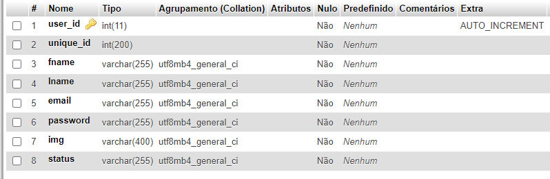
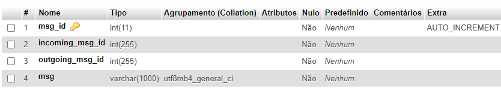

<h1 align="center">
  Chat App
</h1>

## What is it?
Study to improve my knowledge of PHP and javascript. This is a real time chat app.

## Requirements
PHP version 7.4 or higher.

## 🎈 What technologies were used?
 **PHP** - **MySQl** - **HTML** - **CSS** - **AJAX** - **JAVASCRIPT**. 
 
 💡 I used XAMPP server to running the App.
 
 ## 💻 Data Base Structure
 <h3>Users DB structure</h3>
 
 <h3>messages DB structure</h3>
 
